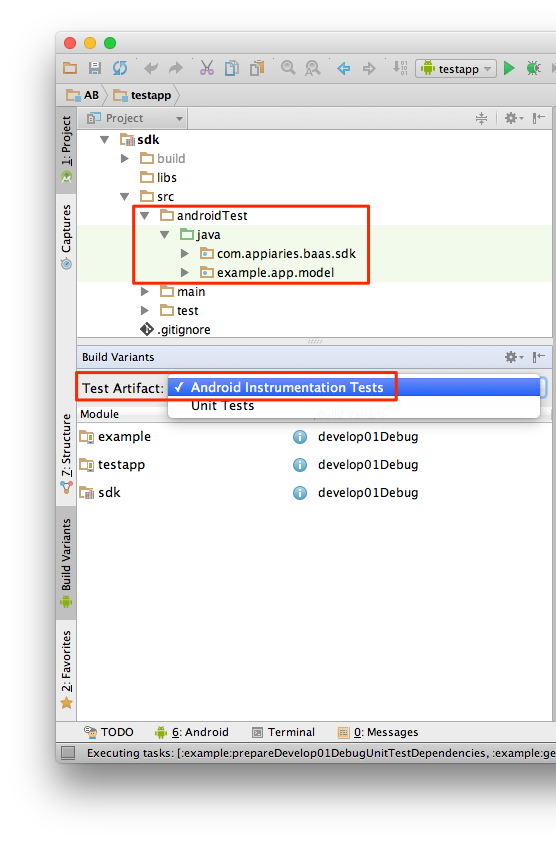

# appiaries-sdk-android

This is a repository for **"Appiaries Android SDK"**
(contains both v1.4 and v2.0).  
Gradle is required to compile.

## Table of Contents
* [Quick Start](#quick)
* [レポジトリについて](#summary)
* [ビルド環境](#environment)
* [ビルド手順](#build)
* [その他、注意点など](#notes)
* [関連リンク](#links)

## Quick Start <a name="quick"></a>

以下は `v2.0` をビルドする場合です。  
`v1.4` をビルドする場合は `1_4` ブランチの README を参照してください。

```bash
cd appiaries-sdk-android
git checkout master
./gradlew makeProductionReleaseZip
ls -l ./build/distributions/ab-android-*-production-release.zip
```

## レポジトリについて <a name="summary"></a>

このリポジトリには **Appiaries Android SDK** について
v1.4 と v2.0 の両方が含まれ、
`1_4` あるいは `master` ブランチをチェックアウトすることで、
それぞれのソースコードが確認いただけます。

| Version | Branch | Description |
|:----:|:----:|----|
| 1.4 | 1_4 | 2014年12月頃にリリースされた SDK です。 アピアリーズ REST API のほとんどをサポートしたバージョンですが、検索機能が貧弱である（ソートや絞り込みができない）点やオブジェクトマッピングを自力で行う必要がある点など、多くの問題が残存しています。ビルドツールに Gradle を利用し始めたバージョンです。 |
| 2.0 | master | 2015年6月にリリースされたバージョンで、Parse、Nifty mBaaS、Backendless に大きな影響を受けています。スクラッチで開発されたバージョンのため、基本的に v1.4 との互換性はありません。このバージョンがサポートする OS のバージョンについてはこちら ([Android](http://docs.appiaries.com/?p=14060) / [iOS](http://docs.appiaries.com/?p=14414)) を参照してください。<br /><font color="#df0000">※ v2.0 では activate メソッド実行時にバージョンのチェックが行われ、必要に応じてマイグレーション・ロジックが実行されます。</font>

## ビルド環境 <a name="environment"></a>

それぞれの SDK をビルドするのに必要となる環境は以下の通りです。

| Name | Version | Notes |
|----|----|----|
| Mac OS X | Yosemite (10.10.5)	| Windows 環境でもビルド可能です。 |
| Android Studio | 1.3.2 | [Android Developers サイト](https://developer.android.com/sdk/index.html) を参考にインストールします。 |
| JDK	| 1.7.0_71 | Android Studio の実行に使用する JDK は 1.8 でも問題ありません。 |
| Gradle | 2.1 | ビルドするために必須となります。 |

## ビルド手順 <a name="build"></a>

[Quick Start](#quick) に記載されるコマンドを実行することでビルドいただけます。

## その他、注意点など <a name="notes"></a>

* UT には Android Instrumentation Tests を使用しています。  


## 関連リンク <a name="links"></a>

* [Android SDK ダウンロード](http://docs.appiaries.com/?p=14066)  
http://docs.appiaries.com/?p=14066
